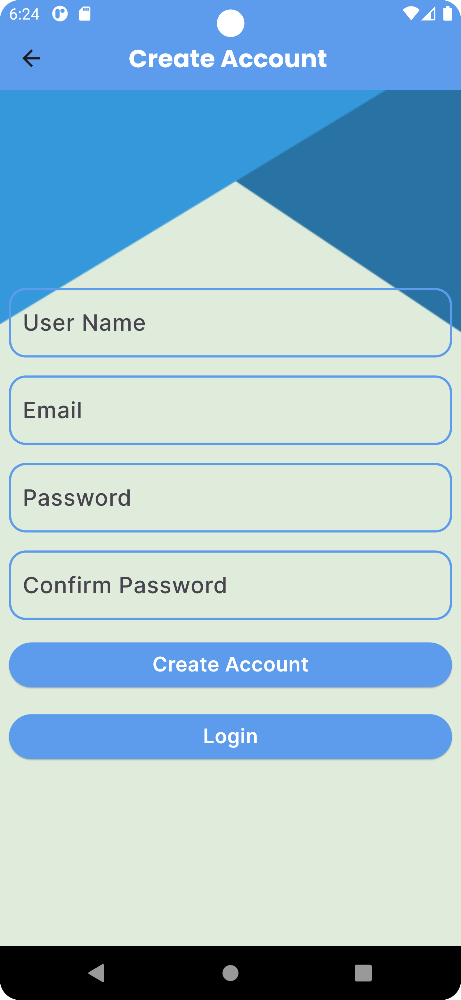
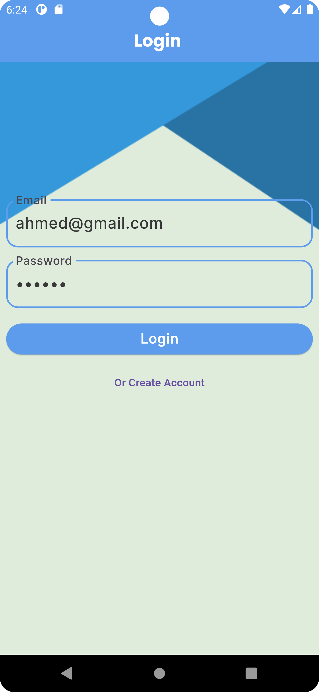
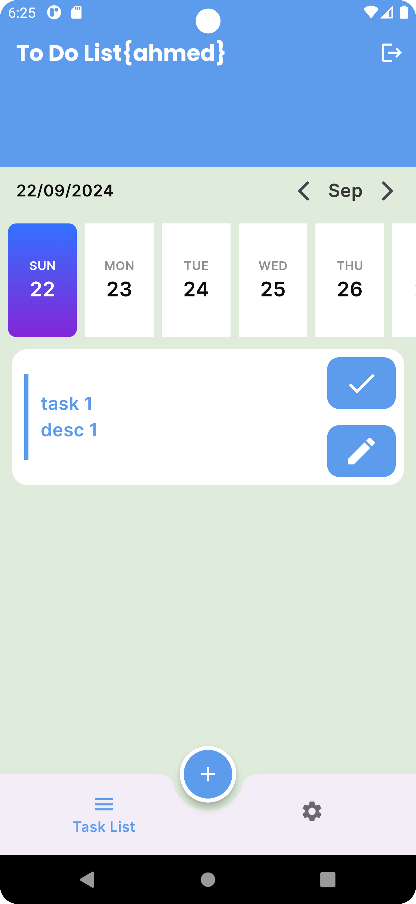
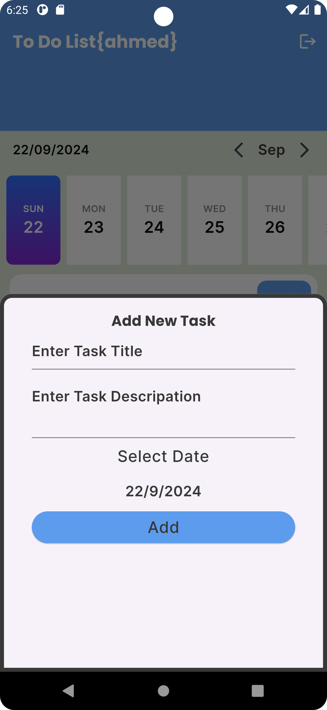
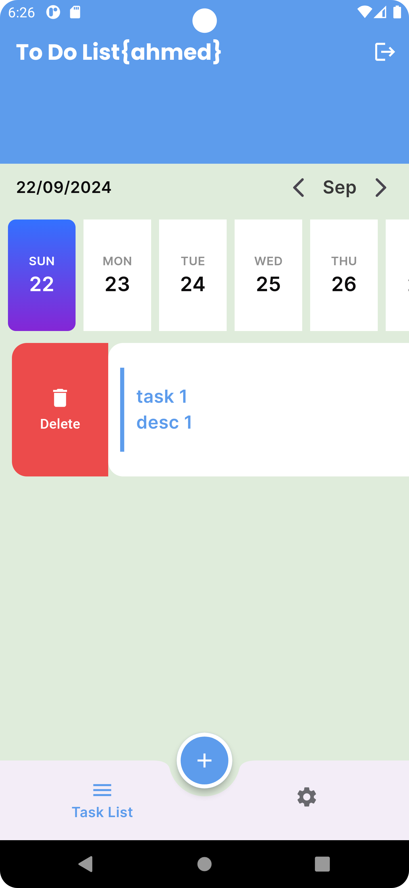
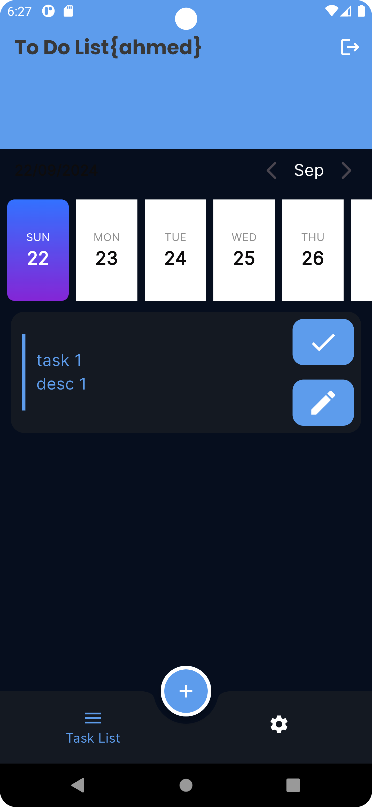
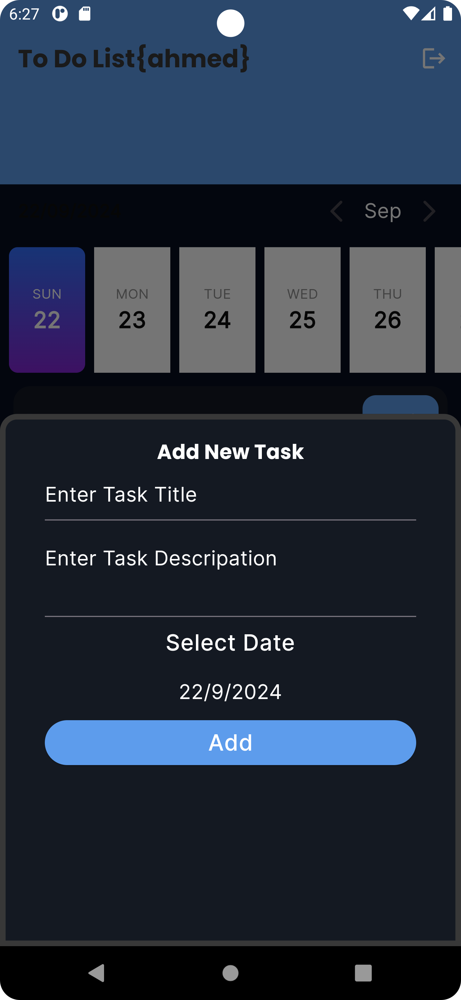
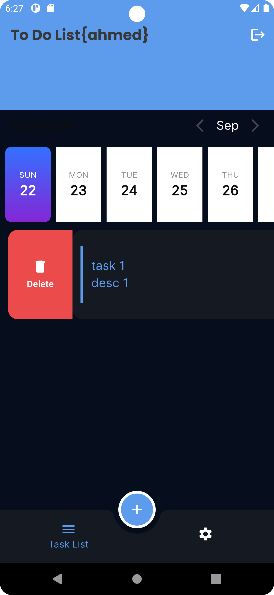

# To-Do App

A comprehensive Flutter application designed to help users organize their daily tasks efficiently.
The app is integrated with Firebase for user authentication and task management, allowing users to
create personalized accounts with their unique tasks. It features a user-friendly interface,
multi-language support, and customization options for a tailored experience.

## Features

- **User Authentication**: Secure login and account creation linked to Firebase.
- **Task Management**: Create, modify, and delete tasks specific to each user account.
- **Task Scheduling**: Set tasks with specific dates and times for better organization.
- **Calendar View**: Intuitive calendar display for an overview of tasks.
- **Task Editing**: Easily modify task details or reschedule for different days.
- **Settings Screen**: Customize app language (available in multiple languages) and theme (
  Dark/Light).
- **Logout Functionality**: Simple sign-out option for user accounts.
- **Multilingual Support**: Available in multiple languages for broader accessibility.
- **Theming Support**: Light and Dark modes for personalized user experience.

## Technologies Used

- **Flutter**: Cross-platform mobile framework.
- **Dart**: Programming language for Flutter.
- **Firebase**: Backend services for user authentication and task management.
- **Provider**: State management solution.
- **Localization**: Supports multiple languages.
- **Calendar Integration**: Visual task management through calendar views.

## Getting Started

To run the application locally, follow these steps:

1. Clone the repository:
   ```bash
   git clone https://github.com/yourusername/todo_app.git

## Screen Shot

### Light Mode







### Dark Mode



